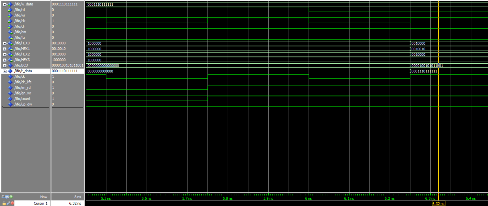

# **Relatório do Projeto 4: Estrutura de Dados LIFO**

**Disciplina:** Sistemas Digitais (ELE3515)
**Alunos:**
* Pedro Arthur Oliveira dos Santos
* Lucas Matheus da Silva Lima

**Professor:** Samaherni Morais Dias
**Data:** 20 de junho de 2025

---

## 1. Introdução
Esse relatório descreve os procedimentos realizados para a concepção do quarto projeto da disciplina de Sistemas Digitais (ELE3515). Foi proposto projetar uma estrutura de dados com a lógica LIFO (LAST IN, FIRST OUT), utilizando uma estrutura de banco de registradores para armazenar os dados da pilha.

Para fazer isso, foram desenvolvidos códigos em VHDL, simulação no Modelsim e testes no kit da DE2.

O circuito terá uma entrada $w_{data}$ de 13 bits para armazenar o valor da entrada a ser escrita em algum endereço de memória dado pelo ponteiro da pilha, que começa em $R = 000$, e que irá ser incrementada conforme forem empilhados os dados na pilha. 

A figura abaixo mostra detalhadamente o esquema inicial do projeto proposto.

*Figura 1: Esquemático do Projeto da Pilha.*

---

## 2. Referencial Teórico
Para este projeto, a teoria principal são as máquinas de estados finitas, e também o método de projeto RTL, que é um projeto a nível de registradores.

No projeto RTL, tem-se dois blocos principais que compõem o componente principal do circuito, que são os blocos de controle e de caminho de dados (Controller e Datapath), que serão discutidos posteriormente, além dos componentes principais que foram desenvolvidos em projetos anteriores utilizando lógica booleana, além dos registradores de carga paralela para armazenar os dados.

Vamos começar discutindo os componentes principais na próxima seção.

### 2.1. Comparador Sequencial de 1 bit
Um comparador sequencial de 1 bit é um circuito capaz de comparar dois bits ($A$ e $B$) e, com base no resultado da comparação dos bits menos significativos (fornecidos pelas entradas de propagação), determinar se a cadeia de bits representada por $A$ é maior, menor ou igual à representada por $B$.

Esse comparador possui três entradas de propagação:
- `in_gt`: sinal indica que, até o bit anterior, $A > B$;
- `in_eq`: sinal indica que, até o bit anterior, $A = B$;
- `in_lt`: sinal indica que, até o bit anterior, $A < B$.

As saídas indicam o resultado da comparação após considerar o bit atual e são:
- `out_gt`: resultado final $A > B$;
- `out_eq`: resultado final $A = B$;
- `out_lt`: resultado final $A < B$.

A tabela abaixo apresenta a tabela verdade de um comparador sequencial de 1 bit.

**Tabela 1: Tabela Verdade do Comparador Sequencial de 1 Bit com Propagação**
| A | B | `in_gt` | `in_eq` | `in_lt` | `out_gt` | `out_eq` | `out_lt` |
|:-:|:-:|:-------:|:-------:|:-------:|:--------:|:--------:|:--------:|
| 0 | 0 |    0    |    1    |    0    |     0    |     1    |     0    |
| 0 | 0 |    1    |    0    |    0    |     1    |     0    |     0    |
| 0 | 0 |    0    |    0    |    1    |     0    |     0    |     1    |
| 0 | 1 |    x    |    x    |    x    |     0    |     0    |     1    |
| 1 | 0 |    x    |    x    |    x    |     1    |     0    |     0    |
| 1 | 1 |    0    |    1    |    0    |     0    |     1    |     0    |
| 1 | 1 |    1    |    0    |    0    |     1    |     0    |     0    |
| 1 | 1 |    0    |    0    |    1    |     0    |     0    |     1    |

Com base na tabela, podemos escrever as expressões lógicas para cada saída:
- `out_gt` $= (A \cdot \overline{B}) + (\overline{A} \cdot \overline{B} \cdot \text{in\_gt}) + (A \cdot B \cdot \text{in\_gt})$
- `out_eq` $= (\overline{A} \cdot \overline{B} + A \cdot B) \cdot \text{in\_eq}$
- `out_lt` $= (\overline{A} \cdot B) + (\overline{A} \cdot \overline{B} \cdot \text{in\_lt}) + (A \cdot B \cdot \text{in\_lt})$

### 2.2. Mux de 2 Canais
Para fazer escolhas, normalmente o componente utilizado é o multiplexador, que seleciona uma das entradas com base em uma chave seletora (Vahid). Um multiplexador 2:1 possui duas entradas de dados ($I_0$ e $I_1$), uma linha de seleção $S$, e uma única saída $Y$.

*Figura 2: Esquemático do multiplexador simples.*

A expressão simplificada do multiplexador é dada por:
$$Y = \overline{S} \cdot I_0 + S \cdot I_1$$Para um multiplexador de N bits, a equação se aplica a cada bit:$$Y^{(n)} = \overline{S} \cdot I_0^{(n)} + S \cdot I_1^{(n)}$$

### 2.3. Registradores em RTL
No projeto RTL (Register Transfer Level), abstraímos a lógica combinacional para ser a entrada de um registrador de carga paralela. A lógica do circuito se concentra na transferência de dados entre registradores.

*Figura 3: Registrador Básico.*

A chave seletora do MUX (sinal de `load`) é uma função das entradas de controle, $Sl = f(I)$, e o carregamento de um novo valor no registrador depende do controle vindo da máquina de estados.

### 2.4. Máquina de Estados Finitos
Muitos circuitos podem ser divididos em estados, de acordo com o valor de suas variáveis em determinados tempos (Tocci). Uma máquina de estados finitos é uma representação em diagrama que descreve todos os estados e transições, sendo fundamental em projetos de sistemas digitais.

### 2.5. Método de Projeto RTL
O método de projeto RTL divide o sistema em dois blocos principais que trocam sinais entre si:
1.  **Controlador (Controller):** Implementa a lógica da máquina de estados.
2.  **Caminho de Dados (Datapath):** Contém os registradores e os componentes que realizam operações com os dados (somadores, comparadores, etc.).

Para a pilha LIFO, o controlador terá quatro estados (inicial, espera, push, pop), enquanto o datapath consistirá no banco de registradores, um contador para o ponteiro da pilha e comparadores para verificar se a pilha está cheia ou vazia.

*Figura 4: Arquitetura de um Projeto RTL.*

---

## 3. Projeto
### 3.1. Multiplexador de 8 Canais
Para selecionar qual dado será lido do banco de registradores, utilizamos um multiplexador de 8 canais. Ele pode ser construído hierarquicamente a partir de multiplexadores 2:1.

*Figura 5: Esquemático do multiplexador de 8 canais.*

### 3.2. Decodificador 3x8 com Enable
O banco de registradores necessita de um decodificador para ativar o `load` de apenas um registrador por vez durante a operação de escrita (push). A entrada `enable` é ativada pelo controlador, e as entradas de seleção ($s_2, s_1, s_0$) correspondem ao endereço do ponteiro da pilha.

**Tabela 2: Tabela Verdade do Decodificador 3x8 com Enable**
| e_n | s2 | s1 | s0 | d7 | d6 | d5 | d4 | d3 | d2 | d1 | d0 |
|:---:|:--:|:--:|:--:|:--:|:--:|:--:|:--:|:--:|:--:|:--:|:--:|
|  1  | 0  | 0  | 0  | 0  | 0  | 0  | 0  | 0  | 0  | 0  | 1  |
|  1  | 0  | 0  | 1  | 0  | 0  | 0  | 0  | 0  | 0  | 1  | 0  |
|  1  | 0  | 1  | 0  | 0  | 0  | 0  | 0  | 0  | 1  | 0  | 0  |
|  1  | 0  | 1  | 1  | 0  | 0  | 0  | 0  | 1  | 0  | 0  | 0  |
|  1  | 1  | 0  | 0  | 0  | 0  | 0  | 1  | 0  | 0  | 0  | 0  |
|  1  | 1  | 0  | 1  | 0  | 0  | 1  | 0  | 0  | 0  | 0  | 0  |
|  1  | 1  | 1  | 0  | 0  | 1  | 0  | 0  | 0  | 0  | 0  | 0  |
|  1  | 1  | 1  | 1  | 1  | 0  | 0  | 0  | 0  | 0  | 0  | 0  |
|  0  | X  | X  | X  | 0  | 0  | 0  | 0  | 0  | 0  | 0  | 0  |

### 3.3. Registrador de Carga Paralela
Um registrador armazena um valor até que o sinal de `load` seja ativado em uma borda de subida do clock.

*Figura 6: Registrador Básico.*

A equação de estado do registrador é:
$$Q^{(i+1)} = (\overline{\text{load}} \cdot Q^i + \text{load} \cdot I) \cdot \text{clk}^{\uparrow}$$

### 3.4. Banco de Registradores
Este componente é a memória da pilha. Ele é composto por 8 registradores de 13 bits em paralelo, um decodificador 3x8 para a escrita e um multiplexador 8x1 para a leitura.

*Figura 7: Esquemático do Banco de registradores 8x13.*

### 3.5. Contador de 3 Bits
Um contador síncrono de 3 bits é usado para gerenciar o ponteiro da pilha (endereços de 0 a 7). Ele pode incrementar (push) ou decrementar (pop) seu valor.

*Figura 8: Esquemático de um contador de 3 bits com controle de direção.*

### 3.6. Datapath
O datapath completo integra o banco de registradores, o contador do ponteiro, comparadores (para checar se a pilha está cheia ou vazia) e multiplexadores, conforme o diagrama abaixo.

*Figura 9: Bloco Datapath da Pilha.*

### 3.7. Máquina de Estados (Controlador)
A máquina de estados gerencia as operações da pilha. Ela possui 4 estados:
- **S_RESET:** Estado inicial, zera o ponteiro.
- **S_WAIT:** Aguarda um comando de `push` ou `pop`.
- **S_PUSH:** Realiza a operação de escrita na pilha e incrementa o ponteiro.
- **S_POP:** Realiza a operação de leitura da pilha e decrementa o ponteiro.

*Figura 10: Máquina de Estados da LIFO.*

---

## 4. Implementação
A implementação em VHDL seguiu o método de projeto RTL, com os blocos de Datapath e Controlador sendo criados a partir dos componentes discutidos.

### 4.1. Diagrama de Blocos Completo
O diagrama abaixo mostra a interconexão final entre o Controlador e o Datapath.

*Figura 11: Projeto Completo da Pilha.*

### 4.2. Código VHDL
Os códigos VHDL para todos os componentes, bem como o projeto completo, estão disponíveis no repositório do projeto no GitHub:
<https://github.com/PedroDS4/Projeto_LIFO>

### 4.3. Implementação no Kit DE2-115
O projeto foi sintetizado utilizando o software **Quartus II**. Os pinos foram mapeados de acordo com o manual da placa DE2-115:
- **Entradas:**
  - `w_data[12:0]`: Chaves `SW[12:0]`
  - `push_btn`: Botão `KEY[1]`
  - `pop_btn`: Botão `KEY[2]`
  - `reset`: Botão `KEY[3]`
- **Saídas:**
  - `r_data[12:0]`: Displays de 7 segmentos `HEX3` a `HEX0`.
  - `full_led`: LED vermelho `LEDR[0]`.
  - `empty_led`: LED verde `LEDG[0]`.

---

## 5. Resultados
### 5.1. Simulação no Modelsim
Uma simulação foi realizada para validar a lógica. O teste consistiu em:
1.  Resetar a pilha (`clr = 1`).
2.  Escrever o valor `1111110111111` no endereço 0.
3.  Escrever o valor `0001110111111` no endereço 1.
4.  Realizar uma operação de `pop`.

O resultado do `pop` foi o último valor inserido (`0001110111111`), confirmando o funcionamento correto da lógica LIFO, como mostra a forma de onda abaixo.

*Figura 12: Simulação de Leitura e Escrita na Pilha.*

### 5.2. Implementação no Kit da DE2
O código foi compilado com sucesso no Quartus II, com alguns avisos (warnings) mas sem erros. O planejamento de pinos foi realizado e o projeto foi testado em laboratório com o auxílio do professor, validando o funcionamento no hardware.

---

## 6. Conclusão
O quarto projeto da disciplina de Sistemas Digitais foi concluído com sucesso. Foi projetada e implementada uma pilha LIFO de 8 posições por 13 bits utilizando o método de projeto RTL. O sistema foi dividido em um bloco de controle (máquina de estados) e um bloco de caminho de dados, que foram descritos em VHDL. A validação foi feita através de simulação no Modelsim e testes práticos no kit de desenvolvimento DE2-115, confirmando que todos os requisitos do projeto foram atendidos.
